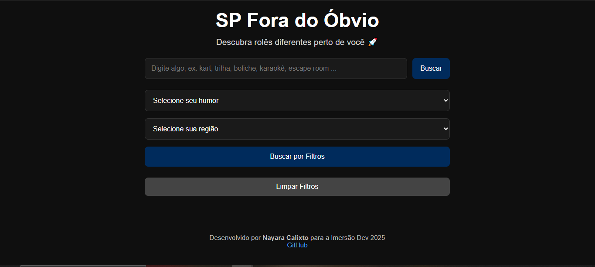
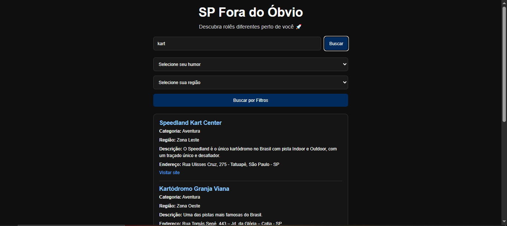
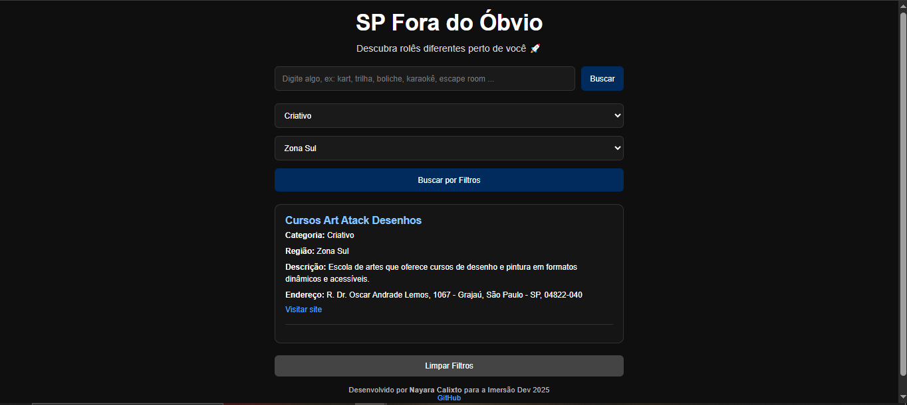
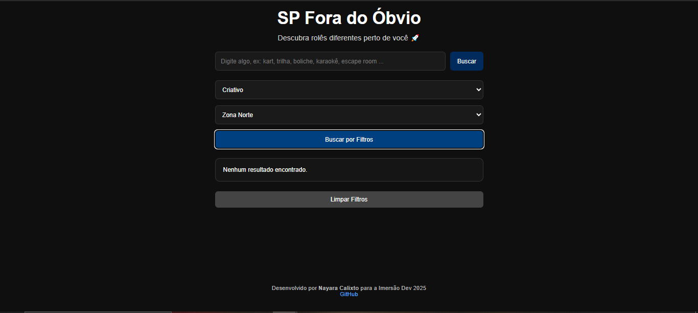

# 📘 SP Fora do Óbvio

## 🛠️ Tecnologias Utilizadas

  <!-- HTML5 -->
  

  <!-- CSS3 -->
  

  <!-- JavaScript -->
  

  <!-- JSON -->
  
  

## 🌍 Visão Geral
SP Fora do Óbvio é um guia interativo para explorar São Paulo além do básico. Mais que descobrir lugares, o projeto convida você a conhecer pessoas, criar novos hobbies e ver a cidade por diferentes ângulos. Nasceu na Imersão Dev 2025 (Alura + Google Gemini) com foco em uma experiência leve, responsiva e centrada no usuário.

- **Propósito**: Conectar humores, regiões e interesses com experiências reais na cidade.

- **Público**: Moradores e visitantes que querem rolês diferentes e socialização.

- **Diferencial**: Busca por texto, filtros combináveis e dados curados por região e tipo de atividade.

---

## 🚀 Funcionalidades
- **Busca por texto**: digite palavras-chave (ex.: “kart”, “trilha”, “karaokê”) e veja resultados relacionados.  
- **Filtros inteligentes**: selecione por **humor** (Aventura, Criativo, Esporte, Social, Natureza, Diferente) e/ou **região** (Norte, Sul, Leste, Oeste, Centro).  
- **Resultados detalhados**: cada card mostra nome, categoria, região, descrição, endereço e link oficial.  
- **Limpar filtros**: botão para resetar busca e filtros rapidamente.  
- **Responsividade**: interface adaptada para desktop e principalmente smartphones.  

---

## ⚙️ Como a aplicação funciona

### 📂 Carregamento de dados
- **Fonte:** `dados.json` (um array de objetos com os campos `nome`, `categoria`, `regiao`, `descricao`, `endereco`, `link`).  
- **Estratégia:** Carregamento assíncrono apenas uma vez; cache em memória (`dados`).

### 🗂️ Modelo de dados

Cada item do **`dados.json`** segue este contrato:

- **nome:** Nome da atração  
- **categoria:** Humor/tema *(Aventura, Criativo, Esporte, Social, Natureza, Diferente)*  
- **regiao:** Zona da cidade *(Zona Norte, Zona Sul, Zona Leste, Zona Oeste, Centro)*  
- **descricao:** Breve explicação da experiência  
- **endereco:** Endereço completo  
- **link:** Site oficial *(HTTPS preferencial)*

### 🔎 Busca por texto
- **Entrada:** Termo digitado no input.  
- **Critério:** Normalização para minúsculas; comparação em `nome` e `descricao`.  
- **Saída:** Lista filtrada; renderização em cards.

### 🎛️ Filtros combináveis
- **Entrada:** Seletores de **humor** e **região**.  
- **Critério:** Igualdade exata com os valores dos itens (`categoria`, `regiao`).  
  - Ambos opcionais; se apenas um estiver selecionado, o outro é ignorado.  
- **Saída:** Lista filtrada; renderização em cards.

### 🖼️ Renderização de resultados
- **Comportamento:** Mostra a área de resultados, limpa conteúdo anterior e adiciona cards.  
- **Fallbacks:** Exibe “Não informado” caso algum campo esteja ausente.

### 💬 Mensagens e estados
- **Sem termo de busca:** “Digite algo para buscar.”  
- **Sem filtros:** “Selecione pelo menos um filtro.”  
- **Sem resultados:** “Nenhum resultado encontrado.”  
- **Limpeza:** Reseta input, selects e oculta a área de resultados.

 ---

## 📑 Passo a Passo de Uso

1. **Abrir o projeto**
- Link para acessar: [SP Fora do Óbvio](https://nayaracalixto.github.io/sp-fora-do-obvio/)
- Tela inicial

3. **Buscar por interesse**  
   - Digite um termo (ex.: “kart”).  
   - Clique em **Buscar**.  
   - Explore os cards retornados e clique em **Visitar site**.
     

4. **Filtrar seu humor e região**  
   - Selecione “Humor” (ex.: Criativo) e/ou “Região” (ex.: Zona Sul).  
   - Clique em **Buscar por Filtros**.  
   - Veja resultados focados no clima e proximidade.
     
 
   - Caso não encontre um resultado, aparecerá um mensagem de "Nenhum resultado encontrado."
     

5. **Refinar ou recomeçar**  
   - Ajuste os filtros para afinar resultados.  
   - Clique em **Limpar Filtros** para começar do zero.  

6. **Descobrir e socializar**  
   - Escolha um rolê, abra o link oficial e combine com amigos.  
   - Crie novos hábitos e explore São Paulo em diferentes perspectivas.  

---

## 📱 Responsividade
- **Layout fluido**: largura máxima de 700px para leitura confortável.  
- **Mobile-first**: quebras específicas em 480px e 360px reorganizam a busca em coluna.  
- **Inputs acessíveis**: botões e campos com áreas generosas para toque.  
- **Tipografia clara**: textos curtos e links com contraste suficiente.  
- **Cartões enxutos**: cada resultado é um bloco autônomo com separação visual.  

---

## 📌 Ícone Melhorias

- 🔗 Arrumar alguns links que não estão funcionando  
- 🗺️ Colocar mais opções de lugares  
- 🌍 Adicionar novas regiões, como **ABC**, **litoral** e **interior**  
- 🍽️ Filtro para gastronomia

---

## 👩‍💻 Autoria
Projeto desenvolvido por **Nayara Calixto** durante a **Imersão Dev 2025 da Alura com o Google Gemini**.  
🔗 [GitHub](https://github.com/NayaraCalixto)

